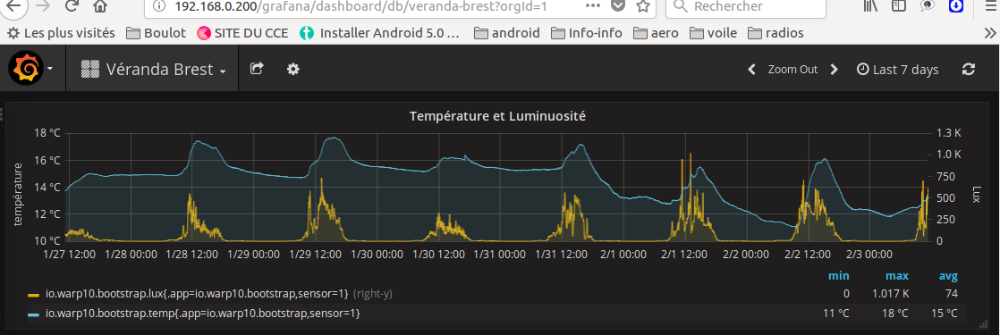
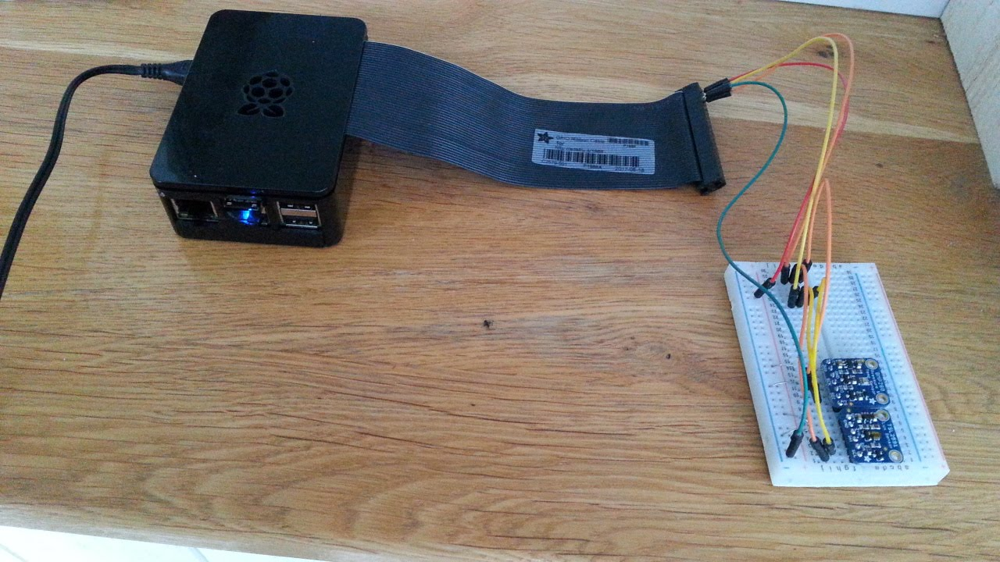
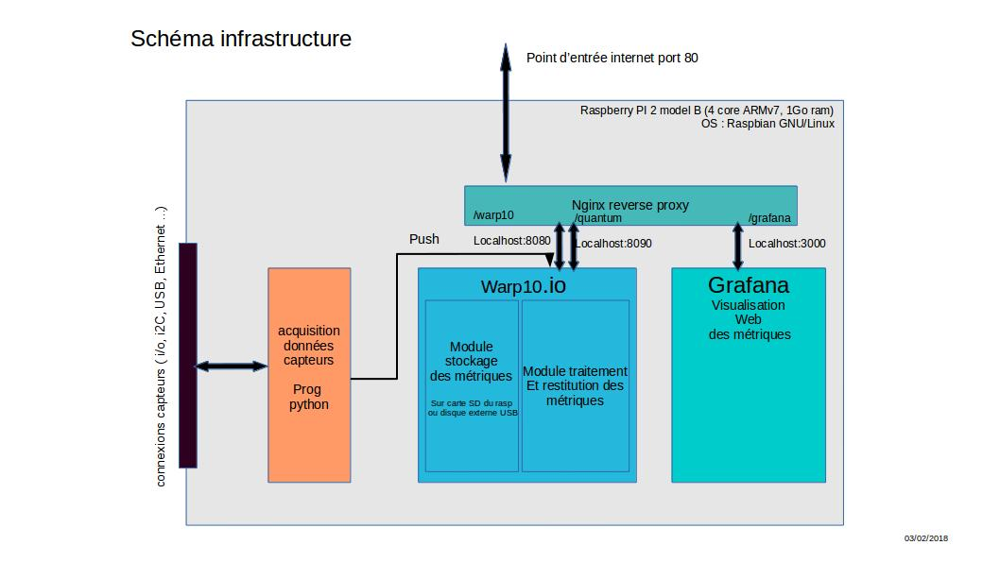

# grafana et warp10 sur Raspberry PI

ce projet présente la mise en oeuvre de Warp10.io et Grafana sur raspberry PI
dans le but de récolter et d'exploiter des métriques provenant de capteurs externes.

Le stockage et l'extration des métriques se fait à partir de l'application warp10 (http://warp10.io)
Les données sont consultées via un navigateur web avec l'application Grafana  ( https://grafana.com/ )

## le projet en actions :
### Exemple exploitation des métriques :

La consultation des relevés des capteurs se fait simplement via un navigateur web.

### les matériels mis en oeuvre :

le Raspbery PI 2 B, avec quelques capteurs connectés en I2C


## Comment faire ...
### schéma des composants logiciels



Nginx : serveur web frontal utilisé en reverse-proxy afin de permettre aux clients ( tablette, ordi, smartphone ) d'accéder aux applications en passant par le port standard http (80). Ceci permet parfois d'éviter aux clients d'être bloqués par les politiques de sécurité mises en places par les fournisseurs d'accès à internet.

Grafana : qu'on ne présente plus...

Warp10 : idem.

Application de capture en python : c'est là que réside le travail de programmation dont les sources sont fournies dans ce dêpot.
Cette appli est à adapter (ou a réécrire entièrement ) en fonction des capteurs à relever. C'est ce programme qui va écrire dans warp10 les métriques via une connexion http de type POST.


### pré-requis
avant de commencer, il faut avoir un raspberry opérationnel. Le rasp utilisé pour ce projet est de type B version 2.
Le système d'exploitation est un linux installé à partir de la distribution officielle à télécharger depuis [Raspbian](https://www.raspberrypi.org/downloads/raspbian/).

graver l'image de raspbian sur microSD. voir [ici](https://www.raspberrypi.org/documentation/installation/installing-images/linux.md)

Une fois la bebête démarrer, clavier et écran connectés, la configurer...
Pour plus de facilité, activer le serveur ssh du rasp afin de s'y connecter depuis son ordinateur favori.
voir la commande
> sudo raspi-config.
	* timezone
	* clavier
	* ssh	
	* activer i2c


### Nginx
* installation
> sudo apt-get nginx

dans le fichier de conf /etc/nginx/sites-enabled/default, ajouter à la rubrique server{}
> sudo vi /etc/nginx/sites-enabled/default

```
server {
	listen 80 default_server;
	listen [::]:80 default_server;
	root /var/www/html;
	index index.html index.htm index.nginx-debian.html;
	server_name _;
	location / {
		try_files $uri $uri/ =404;
	}
	location /grafana/ {
		proxy_pass http://localhost:3000/;
	}
	location /warp10/ {
		proxy_pass http://localhost:8080/;
	}
        location /quantum/ {
                proxy_pass http://localhost:8090/;
        }
}
```
* puis restart de nginx
> sudo systemctl restart nginx.service

un site internet pour comprendre un peu [lien](https://homeserver-diy.net/wiki/index.php?title=Installation_et_configuration_d%E2%80%99un_reverse_proxy_avec_NginX)


### Warp10

#### prérequis
Installer java sdk8 pour ARM :
pour cela aller sur le site d'oracle java http://www.oracle.com/technetwork/java/javase/downloads/index.html
et choisir __SDK v8__

Téléchargé le fichier jdk-8u151-linux-arm32-vfp-hflt.tar.gz
et copier sur le raspberry dans le répertoire /opt .
Puis le décompresser dans ce répertore (/opt)

#### installer warp10
aller sur le site http://www.warp10.io/getting-started/ pour télécharger l'archive tar.gz (clic sur le bouton gris download)
copier le fichier sur le raspberry dans le répertoire /opt
puis le décompresser : `sudo tar xvzf warp10-1.2.12-rc2.tar.gz`

aller dans warp10-1.2.12-rc2/bin : `cd /opt/warp10-1.2.12-rc2/bin`

editer le fichier warp10-standalone.sh pour adapter quelques variables...`sudo vi warp10-standalone.sh`
 
adapter :
```
JAVA_HOME=/opt/jdk1.8.0_151/       <--- fonction de votre install java
WARP10_HEAP=512m		   <--- limite par notre raspberry
WARP10_HEAP_MAX=512m               <--- idem
```

* première exécution
> sudo ./warp10-standalone.sh bootstrap

* ouvrir le fichier /opt/warp10-1.2.12-rc2/etc/conf-standalone.conf
> sudo vi /opt/warp10-1.2.12-rc2/etc/conf-standalone.conf

et redefinir `standalone.host = x.x.x.x`  ou x.x.x.x est l'adresse du lan du rasp. ( par exemple 192.168.0.0) 

* configurer warp10 avec systemd pour redémarrage automatique lors du boot du raspberry

copier le fichier war10.service  vers /lib/systemd/system
> cp /opt/warp10-1.2.12-rc2/bin/warp10.service /lib/systemd/system/
> chmod 644 /lib/systemd/system/pySensors.service /lib/systemd/system/warp10.service
> systemctl daemon-reload
puis démarrage de warp10 ( tada ! )
> systemctl start warp10-service

(fin de la config en user root)

#### tester warp10
depuis un navigateur web, se connecter sur le raspberry pour aller sur quantum : http://[adresse ip du rasp]/quantum
le site suivant doit s'afficher. Ensuite essayer quelques commande warp10 pour vous initier : [warp10](http://www.warp10.io/tools/quantum/)


### Grafana
#### installation
suivre les indications fournies sur le site [grafana-on-raspberry wiki section](https://github.com/fg2it/grafana-on-raspberry/wiki)

en gros :
```
sudo dpkg -i /tmp/grafana_4.6.3_armhf.deb
sudo /bin/systemctl daemon-reload
sudo /bin/systemctl enable grafana-server
```

#### paramétrage
modifier les paramètres __domain__ et __root_url__ du fichier de configuration __/etc/grafana/grafana.ini__

```
\# The public facing domain name used to access grafana from a browser
domain = (le nom de domaine qui hebergera votre site)

\# If you use reverse proxy and sub path specify full url (with sub path)
root_url = ( l'url complete pour atteindre le site grafana ,  exemple  http://votre_domaine/grafana

# Either "mysql", "postgres" or "sqlite3", it's your choice
type = sqlite3
```

#### installation du plugin warp10 :

télécharger en fichier zip le plugin depuis https://github.com/cityzendata/grafana-warp10
`wget -L https://github.com/cityzendata/grafana-warp10/archive/master.zip`

extraire du zip la partie /dist :
`unzip master.zip grafana-warp10-master/dist*`

et renommé plus simplement le plugin 
`mv grafana-warp10-master warp10_plug`

si le répertoire */var/lib/grafana/plugins* n'existe pas alors le créer en user grafana :
`sudo su grafana -c 'mkdir /var/lib/grafana/plugins'`

et enfin déplacer le répertoire warp10_plug dans le répertoire plugins de grafana
`sudo mv warp10_plug /var/lib/grafana/plugins/`

puis définir 'grafana' comme propriétaire du répertoire plugins;
`sudo chown -R grafana:grafana /var/lib/grafana/plugins`

redémarrer grafana pour prendre en compte les modifications :
`sudo systemctl restart grafana-server.service`

#### tester grafana
depuis un navigateur web, se connecter sur le raspberry pour aller sur grafana : http://[adresse ip du rasp]/grafana
Le navigateur doit afficher la page d'acceuil de grafana


TODO :
- doc pour le scrypt python des capteurs

- tutos sur l'utilisation de warp10 puis de grafana.

- rendre accéssible le rasp depuis internet.


